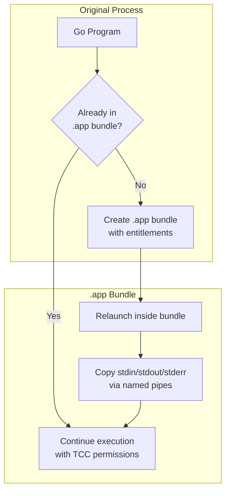

# macgo - macOS App Bundle API for Go

A clean, simple API to enable macOS App Sandbox, Hardened Runtime entitlements, and TCC permissions for Go command-line applications.

## Overview

macOS requires applications to be packaged as `.app` bundles to access protected resources like Camera, Microphone, Files, etc. This package automatically:

1. Detects if your command is already running in an app bundle
2. If not, creates an app bundle with the requested entitlements and relaunches itself through it
3. Handles all I/O redirection using named pipes

**Default Behavior:**
- App Sandbox enabled (`com.apple.security.app-sandbox`)
- User-selected read-only file access enabled (`com.apple.security.files.user-selected.read-only`)
- Invisible in dock and app switcher (runs as a background app via `LSUIElement=true`)

## How It Works



## Installation

```bash
go get github.com/tmc/misc/macgo
```

## Usage

macgo offers multiple approaches to configure your app bundle, from simplest to most advanced:

### 1. Simplest: Blank Import of Auto Package

```go
package main

import (
    "os"
    
    // Just import the auto package with blank identifier
    _ "github.com/tmc/misc/macgo/auto"
)

// Or use pre-configured packages:
// _ "github.com/tmc/misc/macgo/auto/sandbox"         // App sandbox only
// _ "github.com/tmc/misc/macgo/auto/sandbox/readonly" // App sandbox with read-only file access

func main() {
    // Your code will automatically run in an app bundle
    files, _ := os.ReadDir("~/Desktop")
    // ...
}
```

**Pros:** Minimal code, easy for quick scripts  
**Cons:** Less control over initialization timing

### 2. Recommended: Direct API

```go
package main

import (
    "os"
    "github.com/tmc/misc/macgo"
)

func init() {
    // Request specific entitlements
    macgo.RequestEntitlements(
        macgo.EntCamera,
        macgo.EntMicrophone,
        macgo.EntAppSandbox,
    )
    
    // Configure app details
    macgo.SetAppName("MyApp")
    macgo.SetBundleID("com.example.myapp")
    
    // Optionally show in dock (hidden by default)
    // macgo.EnableDockIcon()
}

func main() {
    // Start macgo - this creates the app bundle and relaunches if needed
    macgo.Start()
    
    // Your code will run with the specified entitlements
    files, _ := os.ReadDir("~/Desktop")
    // ...
}
```

**Pros:** Clear, explicit, readable API with configuration in Go code  
**Cons:** Slightly more verbose than blank import

### 3. Specialized: Entitlements Package

```go
package main

import (
    "os"
    
    // Import the entitlements package directly or
    // import specific entitlements with blank identifier
    _ "github.com/tmc/misc/macgo/entitlements/camera"
    _ "github.com/tmc/misc/macgo/entitlements/mic"
    "github.com/tmc/misc/macgo/entitlements"
)

func init() {
    // Use the entitlements package functions if needed
    entitlements.SetPhotos()
    
    // Request multiple entitlements at once
    entitlements.RequestEntitlements(
        entitlements.EntAppSandbox,
        entitlements.EntNetworkClient
    )
}

func main() {
    // Your code will have the specified entitlements
    files, _ := os.ReadDir("~/Desktop")
    // ...
}
```

**Pros:** Modular organization by permission type  
**Cons:** Less direct than the main package's API

### 4. Advanced: Configuration API

```go
package main

import (
    "github.com/tmc/misc/macgo"
)

func init() {
    // Disable auto-initialization to allow complete customization
    macgo.DisableAutoInit()
    
    // Create a custom configuration
    cfg := macgo.NewConfig()
    
    // Set application details
    cfg.ApplicationName = "CustomApp"
    cfg.BundleID = "com.example.customapp" 
    
    // Add entitlements
    cfg.AddEntitlement(macgo.EntCamera)
    cfg.AddEntitlement(macgo.EntMicrophone)
    
    // Request multiple entitlements at once
    cfg.RequestEntitlements(
        macgo.EntAppSandbox,
        macgo.EntNetworkClient
    )
    
    // Add custom Info.plist entries
    cfg.AddPlistEntry("LSUIElement", false) // Show in dock
    
    // Control app bundle behavior
    cfg.Relaunch = true    // Auto-relaunch (default)
    cfg.AutoSign = true    // Auto-sign the bundle
    cfg.KeepTemp = false   // Clean up temporary bundles
    
    // Set custom destination path (optional)
    // cfg.CustomDestinationAppPath = "/Applications/CustomApp.app"
    
    // Apply configuration (must be called)
    macgo.Configure(cfg)
    
    // Explicitly initialize macgo now that configuration is complete
    macgo.Initialize()
}

func main() {
    // Your code will have maximum customization
    // ...
}
```

**Pros:** Maximum flexibility and control  
**Cons:** Most verbose API, steeper learning curve

> **Note:** When using `go run`, macgo first runs your program normally, sets up the app bundle, then relaunches it inside the bundle. Settings like `LSUIElement` (dock visibility) only take effect during this second run in the bundle.

### 5. Environment Variables

Configure macgo with environment variables:

```bash
# Configure the app name and bundle ID
MACGO_APP_NAME="MyApp" MACGO_BUNDLE_ID="com.example.myapp" ./myapp

# Enable specific permissions
MACGO_CAMERA=1 MACGO_MIC=1 MACGO_PHOTOS=1 ./myapp

# Customize app bundle location and behavior
MACGO_APP_PATH="/Applications/MyApp" MACGO_KEEP_TEMP=1 ./myapp

# Enable debugging and show in dock
MACGO_DEBUG=1 MACGO_SHOW_DOCK_ICON=1 ./myapp
```

## Available Entitlements

### TCC Permissions

| Entitlement | Function | Constant | Environment Var |
|------------|----------|----------|----------------|
| Camera     | `SetCamera()`   | `EntCamera`   | `MACGO_CAMERA=1` |
| Microphone | `SetMic()`      | `EntMicrophone` | `MACGO_MIC=1` |
| Location   | `SetLocation()` | `EntLocation` | `MACGO_LOCATION=1` |
| Contacts   | `SetContacts()` | `EntAddressBook` | `MACGO_CONTACTS=1` |
| Photos     | `SetPhotos()`   | `EntPhotos`   | `MACGO_PHOTOS=1` |
| Calendar   | `SetCalendar()` | `EntCalendars` | `MACGO_CALENDAR=1` |
| Reminders  | `SetReminders()`| `EntReminders`| `MACGO_REMINDERS=1` |

### App Sandbox Entitlements

| Entitlement | Function | Constant | Environment Var |
|------------|----------|----------|----------------|
| App Sandbox | `SetAppSandbox()` | `EntAppSandbox` | `MACGO_APP_SANDBOX=1` |
| Outgoing Network* | `SetNetworkClient()` | `EntNetworkClient` | `MACGO_NETWORK_CLIENT=1` |
| Incoming Network* | `SetNetworkServer()` | `EntNetworkServer` | `MACGO_NETWORK_SERVER=1` |

> *NOTE: The network entitlements only affect Objective-C/Swift network APIs. Go's standard networking (net/http, etc.) bypasses these restrictions and will work regardless of these entitlements being present or not. To properly restrict network access in Go applications, additional measures are required.
| Bluetooth | `SetBluetooth()` | `EntBluetooth` | `MACGO_BLUETOOTH=1` |
| USB | `SetUSB()` | `EntUSB` | `MACGO_USB=1` |
| Audio Input | `SetAudioInput()` | `EntAudioInput` | `MACGO_AUDIO_INPUT=1` |
| Printing | `SetPrinting()` | `EntPrint` | `MACGO_PRINT=1` |

### File Access Entitlements

| Entitlement | Constant | Environment Var |
|------------|----------|----------------|
| User-Selected Files (Read) | `EntUserSelectedReadOnly` | `MACGO_USER_FILES_READ=1` |
| User-Selected Files (Write) | `EntUserSelectedReadWrite` | `MACGO_USER_FILES_WRITE=1` |
| Downloads Folder (Read) | `EntDownloadsReadOnly` | `MACGO_DOWNLOADS_READ=1` |
| Downloads Folder (Write) | `EntDownloadsReadWrite` | `MACGO_DOWNLOADS_WRITE=1` |
| Pictures Folder (Read) | `EntPicturesReadOnly` | `MACGO_PICTURES_READ=1` |
| Pictures Folder (Write) | `EntPicturesReadWrite` | `MACGO_PICTURES_WRITE=1` |
| Music Folder (Read) | `EntMusicReadOnly` | `MACGO_MUSIC_READ=1` |
| Music Folder (Write) | `EntMusicReadWrite` | `MACGO_MUSIC_WRITE=1` |
| Movies Folder (Read) | `EntMoviesReadOnly` | `MACGO_MOVIES_READ=1` |
| Movies Folder (Write) | `EntMoviesReadWrite` | `MACGO_MOVIES_WRITE=1` |

### Hardened Runtime Entitlements

| Entitlement | Function | Constant | Environment Var |
|------------|----------|----------|----------------|
| Allow JIT | `SetAllowJIT()` | `EntAllowJIT` | `MACGO_ALLOW_JIT=1` |
| Allow Unsigned Memory | `SetAllowUnsignedMemory()` | `EntAllowUnsignedExecutableMemory` | `MACGO_ALLOW_UNSIGNED_MEMORY=1` |
| Allow DYLD Env Vars | `SetAllowDyldEnvVars()` | `EntAllowDyldEnvVars` | `MACGO_ALLOW_DYLD_ENV=1` |
| Disable Library Validation | `SetDisableLibraryValidation()` | `EntDisableLibraryValidation` | `MACGO_DISABLE_LIBRARY_VALIDATION=1` |
| Disable Exec Page Protection | `SetDisableExecutablePageProtection()` | `EntDisableExecutablePageProtection` | `MACGO_DISABLE_EXEC_PAGE_PROTECTION=1` |
| Debugger | `SetDebugger()` | `EntDebugger` | `MACGO_DEBUGGER=1` |

## API Reference

### Core Functions

```go
// Request entitlements
macgo.RequestEntitlements(macgo.EntCamera, macgo.EntMicrophone)
macgo.RequestEntitlement(macgo.EntAppSandbox)

// Configure app details
macgo.SetAppName("MyApp") 
macgo.SetBundleID("com.example.myapp")

// UI behavior (by default, applications are hidden from dock)
macgo.EnableDockIcon()  // Show app in dock (not recommended)
// or for manual control:
macgo.AddPlistEntry("LSUIElement", true)    // Hide from dock (default in macgo)
// macgo.AddPlistEntry("LSUIElement", false) // Show in dock (causes bouncing icon)

// App bundle behavior
macgo.EnableKeepTemp()  // Keep temporary bundles
macgo.DisableRelaunch() // Disable auto-relaunch
macgo.EnableDebug()     // Enable debug output
macgo.EnableSigning()   // Enable code signing

// Configuration from embedded resources
macgo.LoadEntitlementsFromJSON(jsonData)
macgo.SetCustomAppBundle(templateFS)

// Custom Info.plist entries
macgo.AddPlistEntry("LSMinimumSystemVersion", "10.15")
macgo.AddPlistEntry("NSHighResolutionCapable", true)   // Retina support
```

### Convenience Functions

```go
// Set groups of permissions at once
macgo.SetAllTCCPermissions()  // Set all TCC permissions
macgo.SetAllDeviceAccess()    // Set all device permissions
macgo.SetAllNetworking()      // Set all networking permissions
```

## Features

- Works with both compiled binaries and `go run`
- Sandboxed by default with user-selected file read access
- No dock icon or menu bar entry by default (runs as a background app)
- Intelligent handling of temporary vs permanent app bundles
- SHA256 verification to update only when needed
- I/O redirection with named pipes
- Simple entitlement controls
- Uses `GOPATH/bin` for persistent storage
- Proper cleanup of temporary bundles
- Zero shell script dependency

## Environment Variables

### Configuration Variables
- `MACGO_APP_NAME`: Set the app bundle name
- `MACGO_BUNDLE_ID`: Set the bundle identifier
- `MACGO_APP_PATH`: Custom path for the app bundle
- `MACGO_NO_RELAUNCH=1`: Disable automatic relaunching
- `MACGO_KEEP_TEMP=1`: Keep temporary bundles (don't clean up)
- `MACGO_DEBUG=1`: Enable debug logging
- `MACGO_SHOW_DOCK_ICON=1`: Show app in dock and app switcher (default: hidden)

### Permission Variables
See the tables above for all available permission variables.

## Examples

See the examples directory for complete examples:

- [Simple Example](examples/simple/main.go): Using direct API functions
- [Minimal Example](examples/minimal/main.go): Blank import with environment variables
- [Advanced Example](examples/advanced/main.go): Using the Config API for full customization
- [Custom Template Example](examples/custom-template/main.go): Using a custom app template with embedded files
- [Entitlements Example](examples/entitlements/main.go): Loading entitlements from JSON
- [Customization Example](examples/customization/main.go): Custom app behaviors

## Package Organization

The library is organized as follows:

- **Main Package**: `github.com/tmc/misc/macgo` - Core functionality for app bundle creation
- **Entitlements Package**: `github.com/tmc/misc/macgo/entitlements` - Central package for entitlement management
  - Individual TCC Permission Packages:
    - `github.com/tmc/misc/macgo/entitlements/camera`
    - `github.com/tmc/misc/macgo/entitlements/mic`
    - `github.com/tmc/misc/macgo/entitlements/location`
    - And more...
  - Complete Package: `github.com/tmc/misc/macgo/entitlements/all`

## Design

- Auto-detects app bundles by looking for `.app/Contents/MacOS/[executable name]`
- Temporary binaries (from `go run`) get temporary bundles with cleanup
- Permanent binaries get persistent bundles in `GOPATH/bin`
- SHA256 checksums verify when bundle updates are needed
- Named pipes connect standard input/output/error

## Limitations

- macOS only (does nothing on other platforms)
- macOS permission prompts will appear for each protected resource
- For permanent binaries, `GOPATH/bin` must be writable
- Go's standard library networking bypasses App Sandbox network restrictions. The network entitlements (`EntNetworkClient`, `EntNetworkServer`) only affect Objective-C/Swift network APIs, not Go's standard networking libraries.